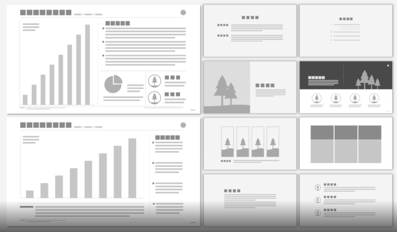
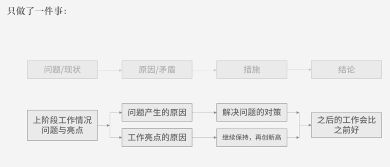
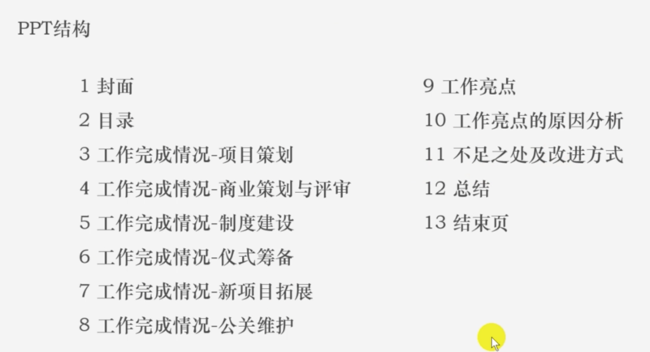
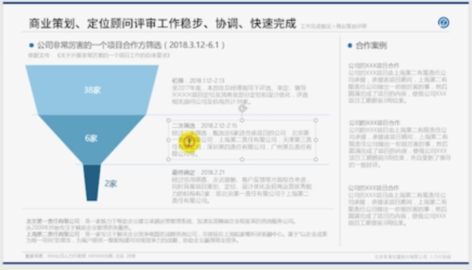
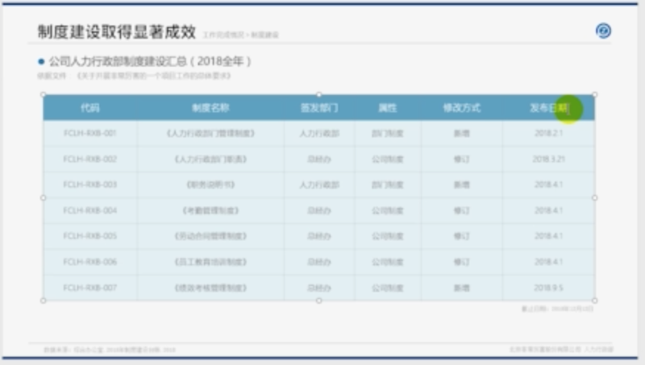
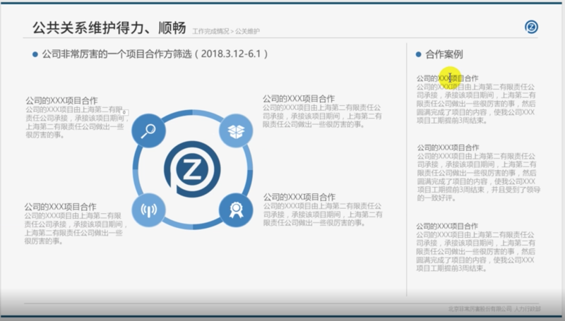
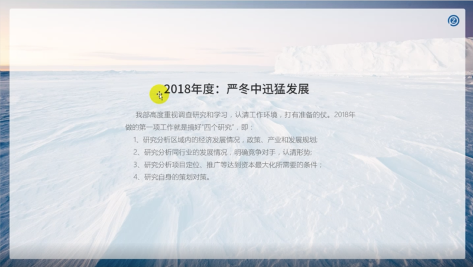
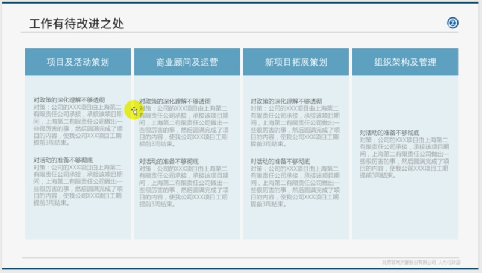
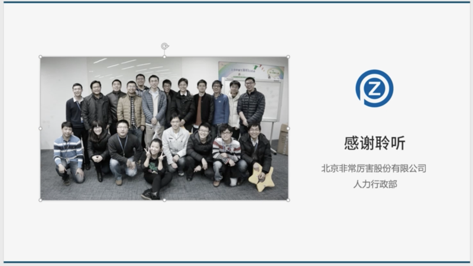
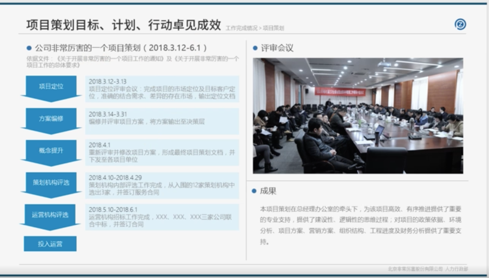

# 0401. 实战篇

## 24. 案例解析和布置汇报任务

做汇报总结的核心目的：告诉老板/领导，我们这段时间做了一些厉害的事，起码对得起工资。汇报和总结属于工作型 PPT，而不是表达型。

篇幅：一般 10-12 页，如果项目或工作很大很复杂，可以适当增加。汇报时间一般 5-10 min。

注意：1、汇报或总结必须有足够的高度。不是打杂的，而是通过我做的一些事情获得一些信息，加工后返回给你的。但是，提升的高度只能提一级，不要提高太多，否则老板不爽，是自杀。比如你是部门里的一个科员，只需要提高本部门即可，不要到事业部、公司层面。2）不要轻易指摘别人的工作。3）一般而言，不要把对公司的建议放在总结中，有建议找领导私下谈。说建议会让领导觉得你在教他怎么做。一个潜规则：大会上决定小事，小会上决定大事。4）讲不足之处的时候，主要讲通过自身努力能弥补的，不要提公司的不足。5）内容可以复杂，结构一定要清晰。6）工作多聊工作，工作少说意义，工作太少讲计划。要把画面撑起来。7）会哭的孩子真的会有奶喝，认真对待每一次在领导面前演示的机会。工作做的好，但领导真的不一定会看到。

文字型汇报/总结：1）表达顺序与 PPT 一致。2）能用数据的地方就用数据，不必忌讳在文字汇报中使用图表（图表占位置，撑场面）。3）详略得当，不要纠结于不足之处和下一阶段展望。4）每个事件加粗写标题加编号。

能让你的汇报总结被刮目相看的一些 point：1、用数据表达一些抽象概念。比如说这个任务大概完成了 80%。2）严格的工期管理，写明白所有事件的起止时间，精确到日。3）正确、得体、合适的图表。4）全局意识，站在高一级看问题。5）上级的任何决策皆有反馈。

## 25. 内容整理

如何把密密麻麻的内容整理简洁好看。

字体规划：1）大标题：思源黑体 CN mediun24。2）小标题：微软雅黑 16。3）正文 1: 微软雅黑 light 12；正文 2：微软雅黑 light 11。4）备注与数据来源：宋体 9。

色彩规划。

## 26. 逐页的设计解析

找图片素材，搜索关键词的时候可以加上「场景」、「摄影」关键词，这样匹配的图片质量会比较高。

1、封面。

大图可以设置成背景，这样可以不影响其他操作。方法：右键，剪切，格式里的填充选择图片或纹理填充，插入图片来自剪切板，接着可以调整下透明度。

大标题处理。如果大标题所在图片背景部分的高度较高，有 2 种处理方式：1）可以选中大标题，格式里的「文本效果」-> 阴影 -> 加个亮的阴影把字托起来。2）用渐变的矩形把大标题衬托起来。新建矩形，无线条，渐变填充，黑色，4 个滑块，角度设为 0（左右向渐变），左右两端透明度 100%，中间的滑块透明度 50-60% 的样子。

2、目录。

进行灰度排版，把文字的颜色都改成深灰，可以用 #545454。一级标题的灰度比二级的深一点。「目录」2 个子的深度更深一点。

插入圆角矩形，把圆角放的非常小即可。

3、汇报 1。

根据金字塔原理，标题即结论。

图片处理一般可以降低饱和度。

大标题下面的横线条颜色一定要浅，因为人肉眼看到线条时会自动将其加深。

善用面包屑导航「 > 」，小号字体，放在大标题右下角，指示当前大标题所在汇报中的位置。

多用细线来分割布局，分割视觉。

4、汇报 2-5。

杂项多的话可以用表格来展示。

柱状图可以用自动的图表，插入。

上面是耦合关系的结构图。

5、工作总结。

结束页，最简单的形式是大图加一段话。

